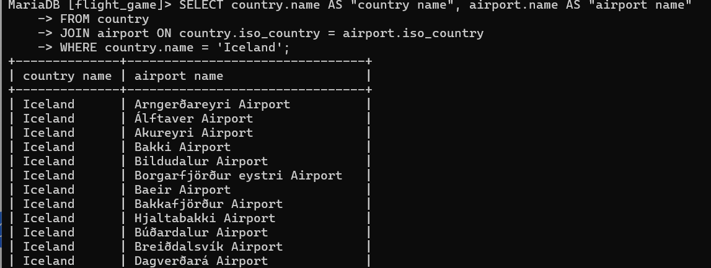
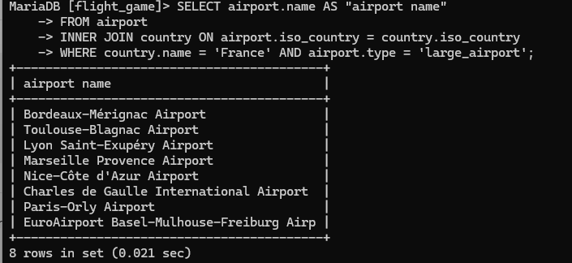
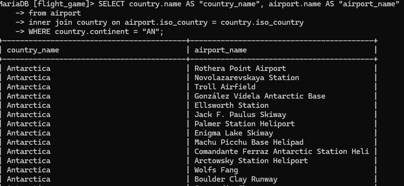
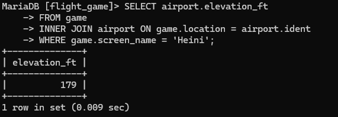
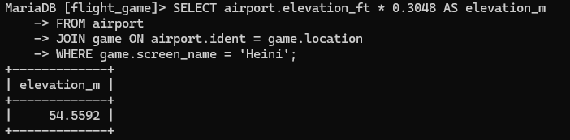
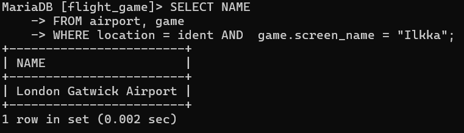
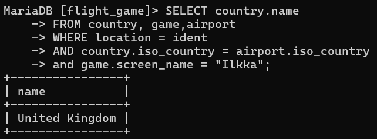
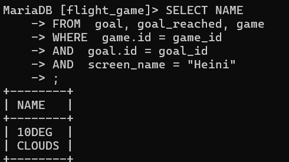
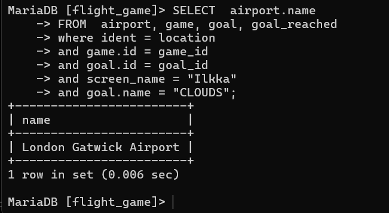
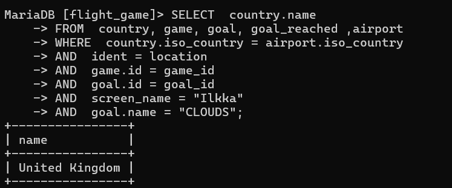

# tehtävä viko 2
### tehtävä1
SELECT country.name AS "country name", airport.name AS "airport name"
FROM airport, country
WHERE airport.iso_country = country.iso_country 
AND  country.name = "Iceland"

### tehtävä2
SELECT airport.name AS "airport name"
FROM airport 
INNER JOIN country ON airport.iso_country = country.iso_country 
WHERE country.name = 'France' AND airport.type = 'large_airport';

### tehtävä3
SELECT country.name AS "country_name", airport.name AS "airport_name"
from airport
inner join country on airport.iso_country = country.iso_country
WHERE country.continent = "AN";

### tehtävä4
SELECT airport.elevation_ft
FROM game
INNER JOIN airport ON game.location = airport.ident
WHERE game.screen_name = 'Heini';

### tehtävä5
SELECT airport.elevation_ft * 0.3048 AS elevation_m
FROM airport
JOIN game ON airport.ident = game.location
WHERE game.screen_name = 'Heini';

### tehtävä6
SELECT NAME
FROM airport, game
WHERE location = ident AND  game.screen_name = "Ilkka";

### tehtävä7
SELECT country.name
FROM country, game,airport
WHERE location = ident
AND country.iso_country = airport.iso_country
and game.screen_name = "Ilkka";

### tehtävä8 
 SELECT NAME
 FROM  goal, goal_reached, game
 WHERE  game.id = game_id
 AND  goal.id = goal_id
 AND  screen_name = "Heini";

### tehtävä9
SELECT  airport.name
FROM  airport, game, goal, goal_reached
where ident = location 
and game.id = game_id 
and goal.id = goal_id 
and screen_name = "Ilkka" 
and goal.name = "CLOUDS";

### tehtävä10
SELECT  country.name
FROM  country, game, goal, goal_reached ,airport
WHERE  country.iso_country = airport.iso_country 
AND  ident = location 
AND  game.id = game_id 
AND  goal.id = goal_id 
AND  screen_name = "Ilkka" 
AND  goal.name = "CLOUDS";

