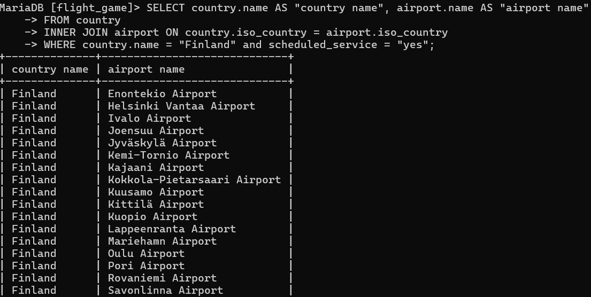
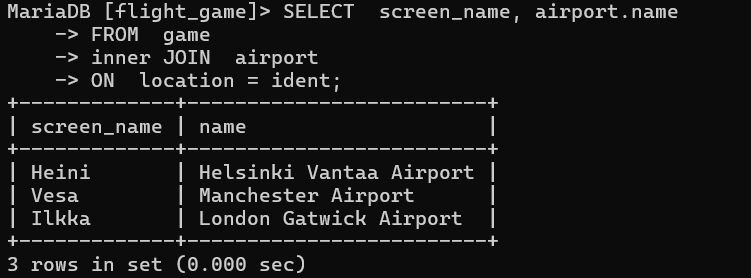
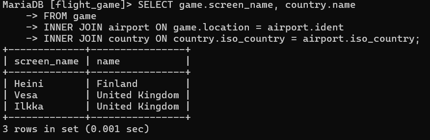

# Tehtävä voko 3
### tehtävä1
SELECT country.name AS "country name", airport.name AS "airport name"
FROM country
INNER JOIN airport ON country.iso_country = airport.iso_country
WHERE country.name = "Finland" and scheduled_service = "yes";

### tehtävä2
SELECT  screen_name, airport.name
FROM  game 
inner JOIN  airport 
ON  location = ident;

### tehtävä3
SELECT game.screen_name, country.name
FROM game
INNER JOIN airport ON game.location = airport.ident
INNER JOIN country ON country.iso_country = airport.iso_country;

### tehtävä4

### tehtävä5

