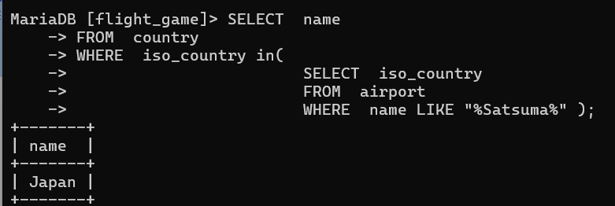
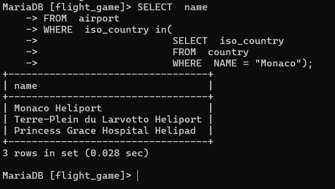
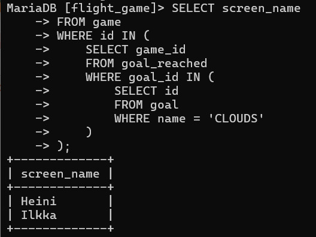

# Tehtävä viikko 3

### tehtävä1
SELECT  name
FROM  country
WHERE  iso_country in(
                        SELECT  iso_country
                        FROM  airport
                        WHERE  name LIKE "%Satsuma%"
                        );

### tehtävä2
SELECT  name
FROM  airport
WHERE  iso_country in(
                      SELECT  iso_country
                      FROM  country
                      WHERE  NAME = "Monaco");

### tehtävä3
SELECT screen_name
FROM game
WHERE id IN (SELECT game_id
FROM goal_reached
WHERE goal_id IN (
SELECT id 
FROM goal
WHERE name = 'clouds'));

### tehtävä4

### tehtävä5
