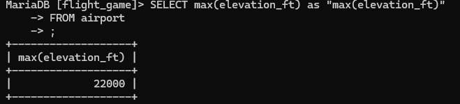
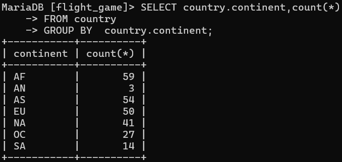
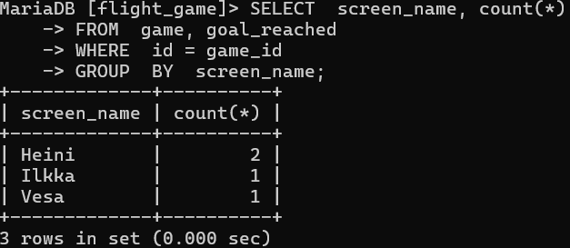
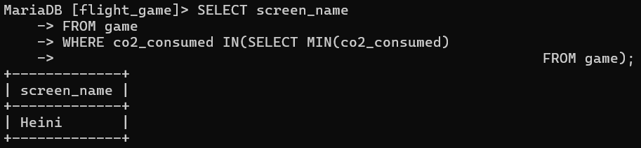
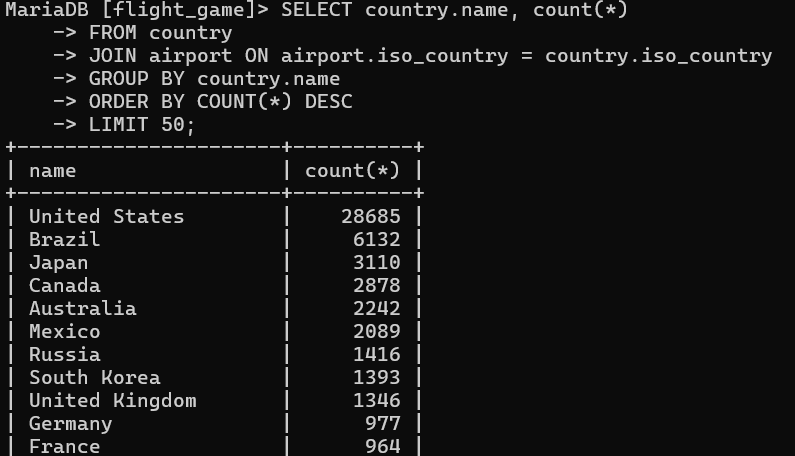

# Tehtävä viikko 4

### tehtävä1
SELECT max(elevation_ft) as "max(elevation_ft)"
FROM airport

### tehtävä2
SELECT country.continent,count(*)
FROM country
GROUP BY  country.continent;

### tehtävä3
 SELECT  screen_name, count(*)
 FROM  game, goal_reached
 WHERE  id = game_id
 GROUP  BY  screen_name;

### tehtävä4
SELECT screen_name 
FROM game
WHERE co2_consumed IN(SELECT MIN(co2_consumed)
                                  FROM game);

### tehtävä5
SELECT country.name, COUNT(*)
FROM country
JOIN airport ON airport.iso_country = country.iso_country
GROUP BY country.name
ORDER BY COUNT(*) DESC
LIMIT 5

### tehtävä6

### tehtävä7

### tehtävä8
