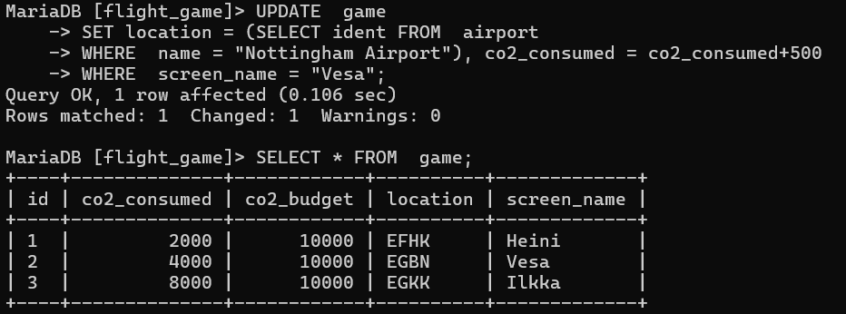

# Tehtävä viikko 4

### tehtävä1
UPDATE  game
SET location=(SELECT ident FROM  airport 
WHERE  name = "Nottingham Airport"), co2_consumed = co2_consumed+500
WHERE  screen_name = "Vesa";
SELECT * FROM  game;

### tehtävä2

### tehtävä3
DELETE  FROM  goal_reached;
SELECT* FROM  goal_reached;

### tehtävä4
DELETE FROM  game;
SELECT* FROM game;

