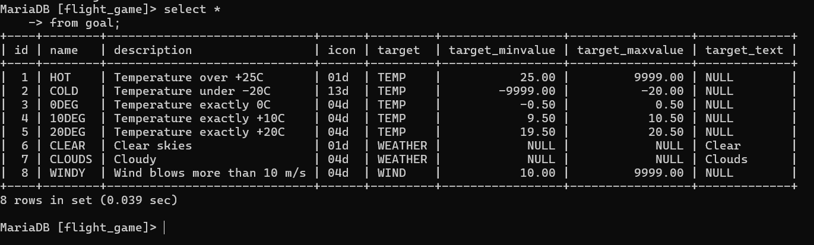
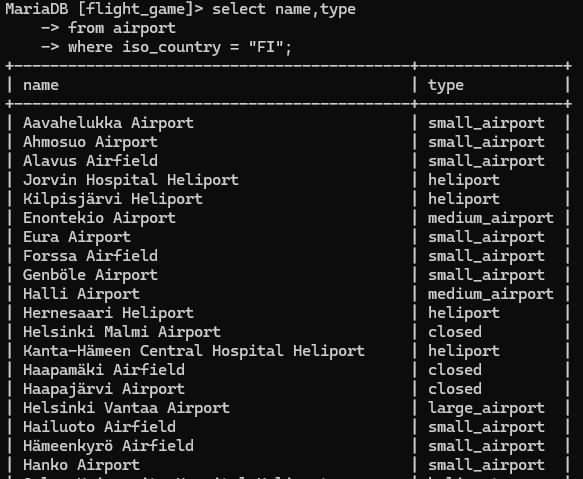
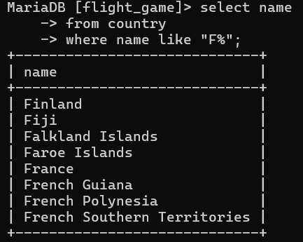

# tehtävä viko 1

### tehtävä1
select *
from goal;

### tehtävä2
select name airport_type 
from airport 
where iso_country = "FI";

### Tehtävä3
Select name 
from airport
where iso_country ="FI"
order by name;
)

### Tehtävä4
select name, type 
from airport 
where iso_country = "FI" 
order by type, name

### Tehtävä5
select name 
from country
where name like "F%"

### Tehtävä6
select name 
from country 
where name like "%F%";

### Tehtävä7
select location 
from game 
where screen_name = "Vesa";

### Tehtävä8
select co2_consumed 
from game 
where screen_name = "Ilkka"

### Tehtävä9
SELECT distinct co2_budget
FROM game;
)